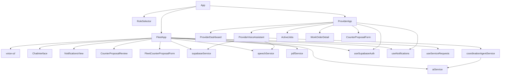

# Architecture

## Overview

Serv is a single-page React application deployed as a Progressive Web App on Cloudflare Pages. All AI inference happens client-side via the OpenAI API (called directly from the browser). Persistent state and multi-user coordination are managed through Supabase (Postgres + Realtime).

There is no backend server. The client calls OpenAI and Supabase directly using environment-variable keys.

## High-Level Data Flow

```
User (voice/tap)
     │
     ▼
Web Speech API ──► SpeechRecognition (input)
     │
     ▼
FleetApp / ProviderVoiceAssistant
     │
     ├──► aiService (OpenAI GPT-4o) ──► text response
     │         │
     │         └──► extractServiceDataFromConversation ──► ServiceRequest fields
     │
     ├──► speechService (OpenAI TTS) ──► MP3 base64 ──► AudioContext playback
     │
     ├──► supabaseService ──► Supabase Postgres ──► Realtime
     │         │                      │
     │         │                      └──► subscribeToServiceRequests
     │         │                           subscribeToMyRequests
     │         │                           subscribeToNotifications
     │         │
     │         └──► RPCs: accept / decline / propose_new_time / approve / reject / complete
     │
     └──► pdfService ──► html2canvas + jsPDF ──► downloadable work order
```

## Module Map



## Role-Based Routing (App.tsx)

`App.tsx` reads the persisted role from `localStorage` and renders one of three top-level trees:

| Condition | Renders |
|---|---|
| No role stored | `<RoleSelector>` |
| Role = `fleet` | `<FleetApp>` |
| Role = `provider` | `<ProviderApp>` |

Role is written to `localStorage` via `userProfileService.setUserRole()` and cleared via `clearUserRole()`.

## Identity Model

The app uses Supabase **anonymous authentication**. On first load, `useSupabaseAuth` calls `signInAnonymously()` if no session exists. This gives each browser a stable `auth.uid()` UUID that is then registered in the `users` table with the chosen role.

Device identity (`heyDeviceId`) is separately stored in `localStorage` and used as the `device_id` column in the `users` table (upsert key). This means the same device always maps to the same user row, even across page refreshes.

## Service Request Lifecycle (9 States)

```
draft ──► submitted ──► accepted ──► completed
              │
              ├──► rejected
              │
              └──► counter_proposed ◄──────────────────┐
                        │                               │
                        ├──► counter_approved           │
                        │         (=accepted)           │
                        │                               │
                        └──► counter_rejected ──────────┘
                                  (back to submitted)
```

State transitions are enforced in Postgres RPCs (`accept_service_request`, `decline_service_request`, `propose_new_time`, `approve_proposed_time`, `reject_proposed_time`, `complete_service_request`). Row Level Security prevents clients from issuing arbitrary updates.

## Voice State Machine (FleetApp)

The fleet voice interface uses an `AssistantState` FSM:

```
idle ──► listening ──► processing ──► responding
                                          │
                        urgent ◄──────────┤ (ERS only, while speaking)
                                          │
                        resolution ◄──────┤ (after service request confirmed)
                                          │
                        pdf-generating    │
                        pdf-ready ◄───────┘
```

Each state maps to a dedicated component in `components/voice-ui/`.

## Real-Time Architecture

Supabase Realtime (Postgres CDC) is used for live updates:

| Channel | Table | Trigger | Consumer |
|---|---|---|---|
| `my-requests-changes` | `service_requests` | UPDATE on `created_by_id` | Fleet `useServiceRequests` |
| `my-notifications` | `service_request_notifications` | INSERT on `recipient_id` | `useNotifications` |
| `service-requests-changes` | `service_requests` | All events | Provider `ProviderVoiceAssistant` |

The notification channel includes a client-side guard that verifies `recipient_id === auth.uid()` before acting, because Supabase Realtime row filters on RLS tables are not always enforced server-side.

## AI Integration Points

| Location | Model | Purpose |
|---|---|---|
| `aiService.ChatSession` | GPT-4o | Conversational dispatch (fleet) |
| `aiService.generateSpeech` | tts-1 | Text-to-speech (MP3) |
| `aiService.extractServiceDataFromConversation` | GPT-4o (json_object) | Structured field extraction from transcript |
| `aiService.extractNameWithAI` | GPT-4o | Extract driver name from natural input |
| `coordinationAgentService.WorkOrderCoordinationAgent` | GPT-4o | Work-order negotiation for provider voice |
| `coordinationAgentService.extractProposedDateTime` | GPT-4o (0 temp) | Counter-proposal date/time parsing |

The API key is read from `import.meta.env.VITE_OPENAI_API_KEY` at runtime. The OpenAI client is instantiated with `dangerouslyAllowBrowser: true` — a known trade-off documented in [decisions.md](decisions.md).
