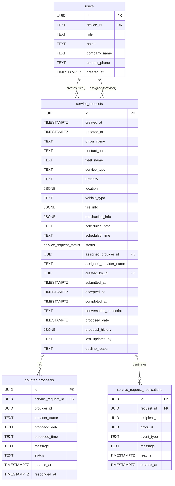

# Data Model

## TypeScript Types

Defined in [types.ts](../types.ts).

### UserRole
```ts
type UserRole = 'fleet' | 'provider';
```

### ServiceRequestStatus (9-state enum)
```ts
type ServiceRequestStatus =
  | 'draft'           // Fleet still filling in via conversation
  | 'submitted'       // Visible to providers
  | 'accepted'        // Provider accepted as-is
  | 'rejected'        // Provider declined
  | 'counter_proposed'// Either party proposed different date/time
  | 'counter_approved'// Fleet approved counter-proposal
  | 'counter_rejected'// Fleet rejected counter-proposal (→ submitted)
  | 'completed'       // Work is done
  | 'cancelled';
```

### ServiceRequest (core entity)
```ts
interface ServiceRequest {
  id: string;                        // UUID
  timestamp: Date;
  driver_name: string;
  contact_phone: string;
  fleet_name: string;
  service_type: ServiceType;         // 'TIRE' | 'MECHANICAL'
  urgency: ServiceUrgency;           // 'ERS' | 'DELAYED' | 'SCHEDULED'
  location: LocationInfo;
  vehicle: VehicleInfo;
  tire_info?: TireServiceInfo;       // Only when service_type = TIRE
  mechanical_info?: MechanicalServiceInfo; // Only when service_type = MECHANICAL
  scheduled_appointment?: ScheduledAppointmentInfo; // Only when urgency = SCHEDULED
  status: ServiceRequestStatus;
  conversation_transcript?: string;
  assigned_provider_id?: string;
  assigned_provider_name?: string;
  counter_proposals?: CounterProposal[];
  created_by_id?: string;
  submitted_at?: string;
  accepted_at?: string;
  completed_at?: string;
  proposed_date?: string;            // ISO 8601 — active proposed time
  proposal_history?: ProposalEntry[]; // Audit log of all proposals
  last_updated_by?: string;
  last_updated_by_name?: string;
  last_updated_by_role?: string;
  decline_reason?: string;
}
```

### Supporting Types
```ts
interface LocationInfo {
  current_location?: string;
  highway_or_road?: string;
  nearest_mile_marker?: string;
  is_safe_location?: boolean;
}

interface VehicleInfo {
  vehicle_type: VehicleType; // 'TRUCK' | 'TRAILER'
}

interface TireServiceInfo {
  requested_service: TireServiceType; // 'REPLACE' | 'REPAIR'
  requested_tire: string;  // e.g. "295/75R22.5"
  number_of_tires: number;
  tire_position: string;   // e.g. "left front steer"
}

interface MechanicalServiceInfo {
  requested_service: string;
  description: string;
}

interface ScheduledAppointmentInfo {
  scheduled_date: string; // YYYY-MM-DD
  scheduled_time: string; // e.g. "10:00 AM"
}

interface ProposalEntry {
  proposed_by: 'fleet_user' | 'service_provider';
  proposed_at: string;  // ISO 8601
  proposed_date: string; // ISO 8601
  notes?: string;
}

interface CounterProposal {
  id: string;
  service_request_id: string;
  provider_id: string;
  provider_name: string;
  proposed_date: string;
  proposed_time: string;
  message: string;
  status: 'pending' | 'approved' | 'rejected';
  created_at: string;
  responded_at?: string;
}
```

### UserProfile (localStorage)
```ts
interface UserProfile {
  userName?: string;
  voiceOutput: VoiceOutputSettings;
  voiceInput: VoiceInputSettings;
  moodHistory: MoodEntry[];
  serviceRequests: ServiceRequest[]; // local copy (pre-Supabase)
}

interface VoiceOutputSettings {
  enabled: boolean;   // always true (not user-configurable)
  rate: number;       // 0.1–10
  pitch: number;      // 0–2
  volume: number;     // 0–1
  voiceURI: string | null; // OpenAI voice name (e.g. 'onyx')
}
```

---

## Database Schema (Supabase)

Full schema in [supabase-schema.sql](../supabase-schema.sql).



## JSONB Columns

`location`, `tire_info`, `mechanical_info`, and `proposal_history` are stored as JSONB. This gives schema flexibility at the cost of query-level type safety.

- `location` — maps to `LocationInfo`
- `tire_info` — maps to `TireServiceInfo` (null when `service_type != TIRE`)
- `mechanical_info` — maps to `MechanicalServiceInfo` (null when `service_type != MECHANICAL`)
- `proposal_history` — array of `ProposalEntry` objects, appended by the `propose_new_time` RPC

## Row Level Security Summary

| Table | Fleet can | Provider can |
|---|---|---|
| `service_requests` | Read own, Insert own, Update (counter-approve/reject/cancel) | Read submitted + assigned, Update (accept/reject/counter) |
| `counter_proposals` | Read on own requests, Update (approve/reject) | Read own, Insert |
| `users` | Read all, Insert/Update own | Same |
| `service_request_notifications` | Read/Update own | Same |

All state-changing operations that require cross-role authorization go through `SECURITY DEFINER` RPCs rather than direct table mutations.

## Indexes

| Table | Index | Purpose |
|---|---|---|
| `users` | `idx_users_device` on `device_id` | User lookup by device |
| `users` | `idx_users_role` on `role` | Role filtering |
| `service_requests` | `idx_sr_status` on `status` | Status filtering |
| `service_requests` | `idx_sr_urgency` on `urgency` | Urgency filtering |
| `service_requests` | `idx_sr_created_by` on `created_by_id` | Fleet user's own requests |
| `service_requests` | `idx_sr_provider` on `assigned_provider_id` | Provider's assigned requests |
| `service_request_notifications` | `idx_srn_recipient` | Notification queries by user |
| `service_request_notifications` | `idx_srn_unread` (partial, `WHERE read_at IS NULL`) | Unread badge count |
